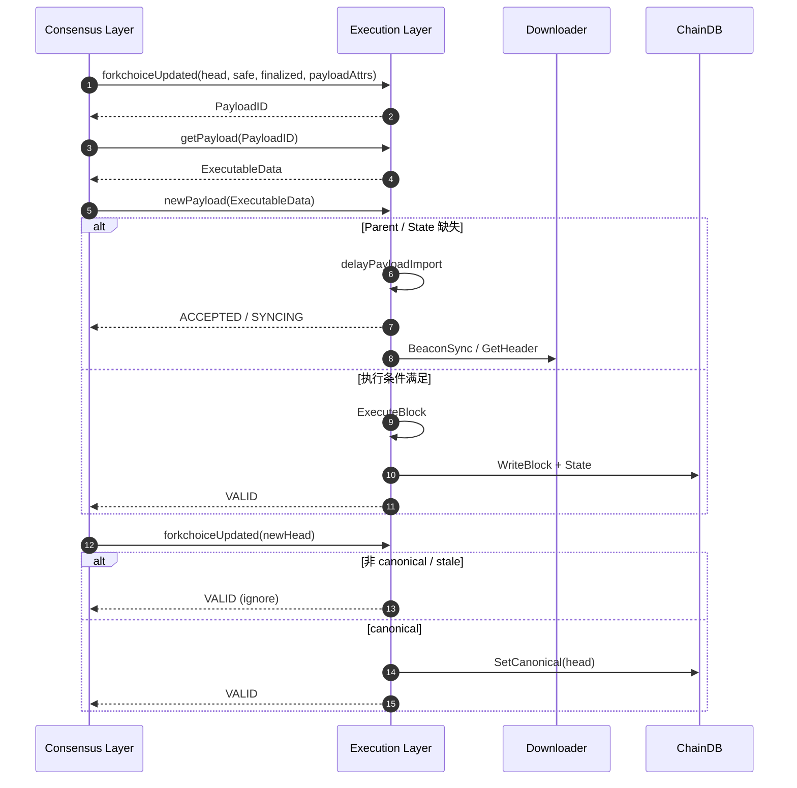
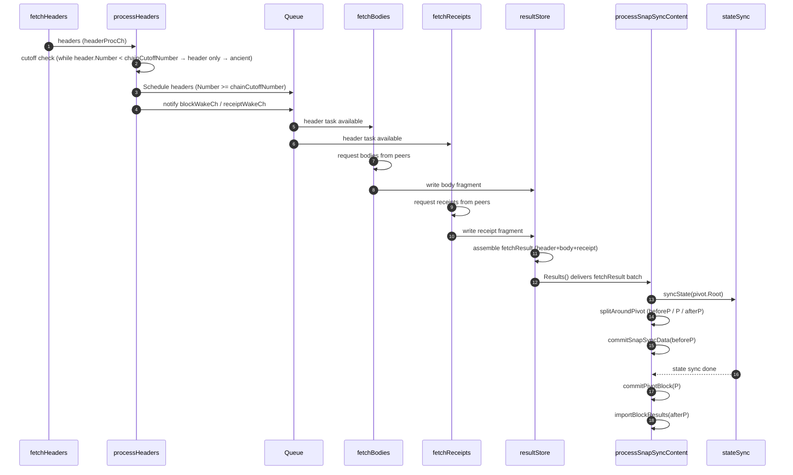

# go-ethereum 源码剖析：执行层（EL）如何修改与维护 Blockchain 状态


> 以上为作者从零开始对Ethereum源码进行剖析，在目前绝大多数的资料中，只是对ethereum的架构做了一个科普性的介绍，没有对ethereum的实现做过多阐述。作为开发者而言，了解web3的前提是必须熟悉一条区块链的底层实现，因为他代表了一种P2P的新范式,这与以往web2的开发模式大相径庭，这更多的是一种理念的创新。不管是Ethereum还是Bitcoin或者说是其他的Layer2以及Solana,其最终都会遵守一个最基本的开发理念:去中心化。作者想通过对Ethereum源码的分析来对当前的所有链的底层原理有一个通俗的理解,同时想借用这系列的文章与更多web3的工作者交流技术。[源码版本下载](https://github.com/0xdoomxy/go-ethereum)


上文讲述了ethereum的交易是如何通过执行层被共识层打包参与共识上链的，接下来我们主要从Blockchain 状态变更出发，讨论执行层是如何进行底层blockchain的状态变更的。



在 PoS 架构下，fork choice 决策权属于共识层（CL）；EL 的职责是验证、执行 CL 下发的 payload，并持久化 world state。两者职责清晰分离：CL 负责决策，EL 负责可验证执行。

在 go-ethereum 中，这一边界被清晰地体现在 eth/catalyst/api.go 中定义的 Engine API 上。其中，真正与链状态演进直接相关的只有两个方法：
+ forkchoiceUpdated：同步 CL 所认定的 canonical 链视图。
+ newPayload：向 EL 提交新区块，执行、验证并持久化状态。


### forkchoiceUpdated

>对于此函数其实上文已经对payload装载有一定的阐述，这里主要是对其引起执行层的状态变更部分进行补充

forkchoiceUpdated 的职责是接收 CL 的共识视图，EL 不执行 EVM，而是：
+ 验证 CL 指定的 head/safe/finalized 对象在本地是否可达与是否可信；
+ 在本地缺失时触发 Downloader（例如 BeaconSync）去拉取 header/body/state；
+ 在满足条件时调整本地 canonical 映射（SetCanonical），并更新 safe/finalized 标记以驱动后续的垃圾回收或快照策略。
```go
func (api *ConsensusAPI) forkchoiceUpdated(
    update engine.ForkchoiceStateV1,
    payloadAttributes *engine.PayloadAttributes,
    payloadVersion engine.PayloadVersion,
    payloadWitness bool,
) (engine.ForkChoiceResponse, error) {
    // 1. 尝试从本地 blockchain 中获取 head block
    block := api.eth.BlockChain().GetBlockByHash(update.HeadBlockHash)

    if block == nil {
        // 2. 执行层不会无条件信任共识层，先检查是否存在已知的 invalid ancestor
        if res := api.checkInvalidAncestor(update.HeadBlockHash, update.HeadBlockHash); res != nil {
            return engine.ForkChoiceResponse{PayloadStatus: *res, PayloadID: nil}, nil
        }
        // 3. 尝试从 remoteBlocks 中获取暂存的 header
        header := api.remoteBlocks.get(update.HeadBlockHash)
        if header == nil {
            // 4. 若本地完全未知该区块，只能通过 Downloader 从 peer 网络拉取
            retrievedHead, err := api.eth.Downloader().GetHeader(update.HeadBlockHash)
            if err != nil {
                return engine.STATUS_SYNCING, nil
            }
            api.remoteBlocks.put(retrievedHead.Hash(), retrievedHead)
            header = retrievedHead
        }

        // 5. 触发 BeaconSync，补齐 finalized → head 之间的缺失区块
        finalized := api.remoteBlocks.get(update.FinalizedBlockHash)
        if err := api.eth.Downloader().BeaconSync(header, finalized); err != nil {
            return engine.STATUS_SYNCING, err
        }
        return engine.STATUS_SYNCING, nil
    }

    // 6. 若 block 已存在，则根据 forkchoice 调整 canonical 视图
    if rawdb.ReadCanonicalHash(api.eth.ChainDb(), block.NumberU64()) != update.HeadBlockHash {
        if latestValid, err := api.eth.BlockChain().SetCanonical(block); err != nil {
            return engine.ForkChoiceResponse{
                PayloadStatus: engine.PayloadStatusV1{
                    Status: engine.INVALID,
                    LatestValidHash: &latestValid,
                },
            }, err
        }
    }
    // 7. 同步 finalized / safe 标记
    if update.FinalizedBlockHash != (common.Hash{}) {
        finalBlock := api.eth.BlockChain().GetBlockByHash(update.FinalizedBlockHash)
        api.eth.BlockChain().SetFinalized(finalBlock.Header())
    }
    if update.SafeBlockHash != (common.Hash{}) {
        safeBlock := api.eth.BlockChain().GetBlockByHash(update.SafeBlockHash)
        api.eth.BlockChain().SetSafe(safeBlock.Header())
    }
    // 8. 若附带 payloadAttributes，则开始构建新区块
    if payloadAttributes != nil {
        // 省略 BuildPayload 细节
    }
    return engine.ForkChoiceResponse{PayloadStatus: engine.PayloadStatusV1{Status: engine.VALID}}, nil
}
```
> 需要强调的是：这里发生的“状态变更”主要是链视图层面的——canonical 指针、safe / finalized 标记等，而非 EVM world state 的执行。真正的状态执行发生在 newPayload 路径中

基于上述对于CL与EL交互的核心方法`forkchoiceUpdated()`的分析，我们可以总结为以下几点:
+ Downloader 负责从 P2P 网络引入、验证并准备 block/body/receipt/state 数据。
+ 区块三态（head/safe/finalized）由 CL 决定，EL 被动校验可执行性。
+ 状态变更分层：forkchoiceUpdated 调整链视图与元信息。
+ payload 执行延迟：缺失状态或父块时，返回 SYNCING，通过 Downloader 补齐后再执行。

### newPayload

```go
func (api *ConsensusAPI) newPayload(params engine.ExecutableData, versionedHashes []common.Hash, beaconRoot *common.Hash, requests [][]byte, witness bool) (engine.PayloadStatusV1, error) {
	api.newPayloadLock.Lock()
	defer api.newPayloadLock.Unlock()

	//将ExecutableData数据转化为block形式,包括withdraw交易
    //这里需要注意的是withdraw交易被单独与transaction交易区分开来，
    //对于ethereum来说withdraw交易是由共识层发起，他不会走传统tx pool
	block, err := engine.ExecutableDataToBlock(params, versionedHashes, beaconRoot, requests)
	if err != nil {
		return api.invalid(err, nil), nil
	}
	api.lastNewPayloadUpdate.Store(time.Now().Unix())
	//判断当前区块是否对于底层存储已知,若已知，则不需要做后续状态变更
	if block := api.eth.BlockChain().GetBlockByHash(params.BlockHash); block != nil {
		log.Warn("Ignoring already known beacon payload", "number", params.Number, "hash", params.BlockHash, "age", common.PrettyAge(time.Unix(int64(block.Time()), 0)))
		hash := block.Hash()
		return engine.PayloadStatusV1{Status: engine.VALID, LatestValidHash: &hash}, nil
	}
	if res := api.checkInvalidAncestor(block.Hash(), block.Hash()); res != nil {
		return *res, nil
	}
	//对区块进行一个基本的校验，并确认该区块是否存在于存储系统中
	parent := api.eth.BlockChain().GetBlock(block.ParentHash(), block.NumberU64()-1)
	if parent == nil {
        //若父区块不存在存储系统中，派遣downloader进行指定的区块同步任务
		return api.delayPayloadImport(block), nil
	}
	if block.Time() <= parent.Time() {
		log.Warn("Invalid timestamp", "parent", block.Time(), "block", block.Time())
		return api.invalid(errors.New("invalid timestamp"), parent.Header()), nil
	}
	//这里是非常巧妙地一个设计，snapsync只适用于节点初始化时快速追上最新区块进度设立，在一切同步完成后，将蜕变为蜕full sync状态，所以当前处于snap sync状态时，那么节点一定未准备就绪
	if api.eth.Downloader().ConfigSyncMode() == ethconfig.SnapSync {
		return api.delayPayloadImport(block), nil
	}
    //判断区块信息以及状态信息是否准备就绪，对于ethereum而言，执行层在receipt、header、body、state的数据同步不是原子性的，尤其是对于state 而言，他需要等待父区块的state准备就绪后，通过本地evm来验证此次状态变更，详细代码在 eth/downloader/downloader.go的synchronise()方法中，后续会讲到
	if !api.eth.BlockChain().HasBlockAndState(block.ParentHash(), block.NumberU64()-1) {
		api.remoteBlocks.put(block.Hash(), block.Header())
		log.Warn("State not available, ignoring new payload")
		return engine.PayloadStatusV1{Status: engine.ACCEPTED}, nil
	}
	log.Trace("Inserting block without sethead", "hash", block.Hash(), "number", block.Number())
    //需要注意的是，在实际运行中，ethereum的底层存储中一定存储了与当前canonical无关的区块以及状态数据，这在达成共识之前是必须要经历的,因为对于LMD-GHOST来说，无法确定当前的"最长链"是否不会发生回滚或者分叉，这里实际来讲会最终调用bc.insertChain(types.Blocks{block}, false, makeWitness)来向存储层保存对应区块链状态并实施状态变更，后续会一起讲到
	proofs, err := api.eth.BlockChain().InsertBlockWithoutSetHead(block, witness)
	if err != nil {
		log.Warn("NewPayload: inserting block failed", "error", err)
		api.invalidLock.Lock()
		api.invalidBlocksHits[block.Hash()] = 1
		api.invalidTipsets[block.Hash()] = block.Header()
		api.invalidLock.Unlock()

		return api.invalid(err, parent.Header()), nil
	}
	hash := block.Hash()

	var ow *hexutil.Bytes
	if proofs != nil {
		ow = new(hexutil.Bytes)
		*ow, _ = rlp.EncodeToBytes(proofs)
	}
	return engine.PayloadStatusV1{Status: engine.VALID, Witness: ow, LatestValidHash: &hash}, nil
}
```

> 从newPayload中可以看到，EL最关键的两步操作是delayPayloadImport以及InsertBlockWithoutSetHead，在实际的代码梳理的过程中delayPayloadImport以及InsertBlockWithoutSetHead都是最终执行的insertChain来对底层存储进行修改，但是delayPayloadImport的过程更为复杂，原因如下:对于InsertBlockWithoutSetHead而言，在执行之前已经具备充分条件，1.parent state已经在数据库里面存在，2.当前header的所有transaction已经在数据库中存在，但是对于delayPayloadImport而言，一切都还未准备就绪。

基于上述对于CL与EL交互的核心方法`newPayload`的分析，我们可以总结为以下几点:
1. `newPayload`主要通过`InsertBlockWithoutSetHead` 和 `delayPayloadImport`方法对每一个payload进行处理.
2. 对于`delayPayloadImport`和 `InsertBlockWithoutSetHead`实际作用而言: `delayPayloadImport` 在 `InsertBlockWithoutSetHead`操作之前会进行 `getReceipt`、`getHead`、`getstate`等前置操作以便正常完成`InsertBlockWithoutSetHead`


### 总结

通过对于`newPayload` 和 `forkchoiceUpdated`的梳理，我们可以确定的是，`downloader`在EL的同步过程中占据了不可替代的分量。接下来我将从`downloader`入手，分析EL是如何同步未知的区块并基于此区块进行状态变更最终写入存储层中.


## Downloader

```go
type Downloader struct {
    //判断Synchronisation()函数所处的状态,snap sync or full sync or not start
	mode  atomic.Uint32  
    //当前的区块同步状态，snap sync or full sync
	moder *syncModer     
    //Important:数据同步的主要调度者,把“并发、乱序、分 peer 的区块碎片，收敛成“可按高度线性提交的 fetchResult 流
	queue *queue   // 
    //数据获取的p2p节点
	peers *peerSet // Set of active peers from which download can proceed
	stateDB ethdb.Database // Database to state sync into (and deduplicate via)
	blockchain BlockChain
	//告知哪些header需要被获取，主要由fetchHeaders()提供,由processHeaders()消耗并调度fetchBodies和fetchReceipts
	headerProcCh chan *headerTask 

	// Important:在eth2 中，skeleton用于构建“稀疏的 Header 骨架链（skeleton）”的结构体它并非完整链（没有 bodies/state），而是快速建立起从 finalized 到 head 的 header 骨架。
	skeleton *skeleton 

	// Important:仅在snap sync模式中使用,用于设置state可信的header
	pivotHeader *types.Header 
	pivotLock   sync.RWMutex  
    //Important:主要用于snap sync模式下的state快照的同步
	SnapSyncer     *snap.Syncer 
	stateSyncStart chan *stateSync 
}
```


对于`Downloader`而言，其运作体系非常复杂和繁琐，在实际实现过程中频繁通过`Channel`机制来进行工作协程的通信以满足区块同步的数据需求.

其初始化在eth/backend.go 的New()方法中

```go
// New creates a new downloader to fetch hashes and blocks from remote peers.
func New(stateDb ethdb.Database, mode ethconfig.SyncMode, mux *event.TypeMux, chain BlockChain, dropPeer peerDropFn, success func()) *Downloader {
	cutoffNumber, cutoffHash := chain.HistoryPruningCutoff()
	dl := &Downloader{
		stateDB:           stateDb,
		moder:             newSyncModer(mode, chain, stateDb),
		mux:               mux,
		queue:             newQueue(blockCacheMaxItems, blockCacheInitialItems),
		peers:             newPeerSet(),
		blockchain:        chain,
		chainCutoffNumber: cutoffNumber,
		chainCutoffHash:   cutoffHash,
		dropPeer:          dropPeer,
		headerProcCh:      make(chan *headerTask, 1),
		quitCh:            make(chan struct{}),
		SnapSyncer:        snap.NewSyncer(stateDb, chain.TrieDB().Scheme()),
		stateSyncStart:    make(chan *stateSync),
		syncStartBlock:    chain.CurrentSnapBlock().Number.Uint64(),
	}
	// 初始化"骨架链"
	dl.skeleton = newSkeleton(stateDb, dl.peers, dropPeer, newBeaconBackfiller(dl, success))
    //开启执行state数据获取的协程
	go dl.stateFetcher()
	return dl
}
//stateFetcher() 的职责是作为状态同步的启动协调器。它阻塞等待 stateSyncStart 信号，一旦收到触发条件，即启动一次状态同步流程（runStateSync）。在 Snap Sync 模式下，具体的状态下载、校验与落盘由 SnapSyncer.Sync 统一执行，完成对执行层状态（accounts / storage / bytecode）的同步与修复。
func (s *stateSync) run() {
	close(s.started)
	s.err = s.d.SnapSyncer.Sync(s.root, s.cancel)
	close(s.done)
}

//newSkeleton()会启动一个startup()协程来监听headEvents信号量从而开启骨架链的同步到最终state、block的落盘
func (s *skeleton) startup() {
	for {
		select {
		case errc := <-s.terminate:
			// No head was announced but Geth is shutting down
			errc <- nil
			return

		case event := <-s.headEvents:
			for {
                //只有当event force 为true时才真正执行s.sync
                if !event.force {
				event.errc <- errors.New("forced head needed for startup")
				continue
			    }
				newhead, err := s.sync(head)
			}
		}
	}
}
```

对于startup()以及stateFetcher()都需要通过信号量来执行对应的sync()函数,在分析`newPayload`以及`forkchoiceUpdated`后，我们得知其通过downloader最终都调用了`beaconSync`函数

```go
func (d *Downloader) beaconSync(head *types.Header, final *types.Header, force bool) error {
	// Signal the skeleton sync to switch to a new head, however it wants
	return d.skeleton.Sync(head, final, force)
}
func (s *skeleton) Sync(head *types.Header, final *types.Header, force bool) error {
	log.Trace("New skeleton head announced", "number", head.Number, "hash", head.Hash(), "force", force)
	errc := make(chan error)

	select {
	case s.headEvents <- &headUpdate{header: head, final: final, force: force, errc: errc}:
		return <-errc
	case <-s.terminated:
		return errTerminated
	}
}
```
真正意义上，他从headEvents channel里面阻塞地写入数据，意味着skeleton的startup()中`s.sync(head)`开始执行.

```go

func (s *skeleton) sync(head *types.Header) (*types.Header, error) {
    //根据head恢复skeleton同步的状态(skeleton会在底层持久化skeletonProgress结构体来记录skeleton的进度)
	if head == nil {
		head = rawdb.ReadSkeletonHeader(s.db, s.progress.Subchains[0].Head)
	} else {
		s.initSync(head)
	}
	s.scratchSpace = make([]*types.Header, scratchHeaders)
	defer func() { s.scratchSpace = nil }()
	s.scratchOwners = make([]string, scratchHeaders/requestHeaders)
	defer func() { s.scratchOwners = nil }() 
	s.scratchHead = s.progress.Subchains[0].Tail - 1 
	//这里的len(s.progress.Subchains) == 1判定非常巧妙，表明 skeleton header 已经从多段拓扑结构收敛为唯一线性链，因而 scratchHead 所在的区块段可以在 header 层面无歧义地接入 Subchains[0]
	linked := len(s.progress.Subchains) == 1 &&
		rawdb.HasHeader(s.db, s.progress.Subchains[0].Next, s.scratchHead) &&
		rawdb.HasBody(s.db, s.progress.Subchains[0].Next, s.scratchHead) &&
		rawdb.HasReceipts(s.db, s.progress.Subchains[0].Next, s.scratchHead)
	if linked {
        //当ethereum认定skeleton已经找到head->local chain的骨架链时,会调用此方法获取body、receipt、state数据.
		s.filler.resume()
	}
	defer func() {
		done := make(chan struct{})
		go func() {
			defer close(done)
            //结束filler的所有任务
			filled := s.filler.suspend()
			if filled == nil {
				log.Warn("Latest filled block is not available")
				return
			}
			// 根据当前的最新快照修改skeleton的header chain状态,主要是修改subchains和以及删除old subchains[0].tail -> CurrentBlockSnap 之间的历史skeleton header.这里要区分一个意义，skeleton至少能保证subchains[0].tail在底层存储中的header是完整的
			if err := s.cleanStales(filled); err != nil {
				log.Error("Failed to clean stale beacon headers", "err", err)
			}
		}()
		for {
			select {
			case <-done:
				return
			case event := <-s.headEvents:
				event.errc <- errors.New("beacon syncer reorging")
			}
		}
	}()
	var (
		requestFails = make(chan *headerRequest)
		responses    = make(chan *headerResponse)
	)
	cancel := make(chan struct{})
	defer close(cancel)
	defer func() {
		s.requests = make(map[uint64]*headerRequest)
	}()
	peering := make(chan *peeringEvent, 64) 
	peeringSub := s.peers.SubscribeEvents(peering)
	defer peeringSub.Unsubscribe()
	s.idles = make(map[string]*peerConnection)
	for _, peer := range s.peers.AllPeers() {
		s.idles[peer.id] = peer
	}
	// syncstarting仅在测试时使用
	if s.syncStarting != nil {
		s.syncStarting()
	}
    //这里的循环主要作用为在skeleton未和local chain连通时，快速通过assignTasks来进行构建
	for {
		//当skeleton不能与本地的blockchain连通时，
        //skeleton通过assignTasks快速请求header数据来构建"骨架链"
        //这里skeleton做出了一些优化，他将多个headers交付给一个peer进行获取,减少了请求的数量
		if !linked {
			s.assignTasks(responses, requestFails, cancel)
		}
		select {
		case event := <-peering:
			peerid := event.peer.id
			if event.join {
				s.idles[peerid] = event.peer
			} else {
				s.revertRequests(peerid)
				delete(s.idles, peerid)
			}

		case errc := <-s.terminate:
			errc <- nil
			return nil, errTerminated

		case event := <-s.headEvents:
			//在EL接收到CL通过forkchoiceUpdated和newPayload对head的变更时调整subchains的状态.这里只接受相对subchains连续并且非分叉的head区块.对于final区块而言,共识机制保证了其不可reorg的特性.
			if err := s.processNewHead(event.header, event.final); err != nil {
				if event.force {
					event.errc <- nil // forced head reorg accepted
					log.Info("Restarting sync cycle", "reason", err)
					return event.header, errSyncReorged
				}
				event.errc <- err
				continue
			}
			event.errc <- nil 
            //这里的linked应该是无用的判断，对于任何select来讲，都不可能在未退出之前让linked = true 
			if linked {
				s.filler.resume()
			}

		case req := <-requestFails:
			s.revertRequest(req)

		case res := <-responses:
             //根据assignTasks()向p2p节点请求的header结果快速构建骨架链，并评估对于原来的subchains是否发生了linked和merged
			linked, merged := s.processResponse(res)
			if linked {
				return nil, errSyncLinked
			}
			if merged {
				return nil, errSyncMerged
			}
		}
	}
}
```

***linked：指 skeleton 已经与本地链（local current chain）在 header 层面连通（即 header 骨架可以衔接到本地已有区块），因此可以开始 body/receipt/state 的回填。***

***merged：指多个 subchains 被合并为一条线性链（或发生 reorg 合并），skeleton 的内部结构发生合并***

对于sync函数而言，skeleton基于subchains主要进行如下的工作:
1. 永远尝试对骨架链进行收敛，在收敛成线性时调用filler.resume()对相关的receipt、body、state数据进行获取并持久化到底层存储中.
2. 不断跟随CL对于当前ethereum的head以及finalied状态的共识，并基于此对当前skeleton chain 进行重组、补充、删除.

> 这里不会去细讲assignTasks()方法，他本质是任务分配，并将每个任务通过go s.executeTask(idle, req)去向p2p节点发出peer.peer.RequestHeadersByNumber(req.head, requestCount, 0, true, resCh)请求，并将结果写回responses通道中然后调用processResponse进行处理

当skeleton已经构建了骨架链之后,会告知filler去使用resume()同步对应的body、receipt、state数据.

```go
// resume starts the downloader threads for backfilling state and chain data.
func (b *beaconBackfiller) resume() {
	//同一时刻只允许一个filler执行resume
    b.lock.Lock()
	if b.filling {
		b.lock.Unlock()
		return
	}
	b.filling = true
	b.filled = nil
    //中断filler的channel 
	b.started = make(chan struct{})
	b.lock.Unlock()
	go func() {
		// Set the backfiller to non-filling when download completes
		defer func() {
			b.lock.Lock()
			b.filling = false
            //CurrentSnapBlock()代表能够获取完整数据的最新区块
			b.filled = b.downloader.blockchain.CurrentSnapBlock()
			b.lock.Unlock()
		}()
        //获取body、state、receipt数据的核心逻辑
		if err := b.downloader.synchronise(b.started); err != nil {
			log.Error("Beacon backfilling failed", "err", err)
			return
		}
		if b.success != nil {
			b.success()
		}
	}()
}

func (d *Downloader) synchronise(beaconPing chan struct{}) (err error) {
	if beaconPing != nil {
		defer func() {
			select {
			case <-beaconPing: // already notified
			default:
				close(beaconPing) // weird exit condition, notify that it's safe to cancel (the nothing)
			}
		}()
	}
	//synchronising只允许downloader同一时间只执行一次
	if !d.synchronising.CompareAndSwap(false, true) {
		return errBusy
	}
	defer d.synchronising.Store(false)

	if d.notified.CompareAndSwap(false, true) {
		log.Info("Block synchronisation started")
	}
	mode := d.moder.get()
	defer func() {
        //Important:在一切准备就绪时，切换sync模式为full sync
		if err == nil && mode == ethconfig.SnapSync {
			d.moder.disableSnap()
		}
	}()
	if mode == ethconfig.SnapSync {
		if d.blockchain.TrieDB().Scheme() == rawdb.PathScheme {
			if err := d.blockchain.TrieDB().Disable(); err != nil {
				return err
			}
		}
		if snapshots := d.blockchain.Snapshots(); snapshots != nil { // Only nil in tests
			snapshots.Disable()
		}
	}
    //queue是synchronising的核心所在,每次进入时重置
	d.queue.Reset(blockCacheMaxItems, blockCacheInitialItems)
	d.peers.Reset()
    //释放之前channel中遗留的信号量
	for _, ch := range []chan bool{d.queue.blockWakeCh, d.queue.receiptWakeCh} {
		select {
		case <-ch:
		default:
		}
	}
	for empty := false; !empty; {
		select {
		case <-d.headerProcCh:
		default:
			empty = true
		}
	}
	d.cancelLock.Lock()
	d.cancelCh = make(chan struct{})
	d.cancelLock.Unlock()

	defer d.Cancel()

	d.mode.Store(uint32(mode))
	defer d.mode.Store(0)

	if beaconPing != nil {
		close(beaconPing)
	}
	return d.syncToHead()
}

func (d *Downloader) syncToHead() (err error) {
	mode := d.getMode()
	// 获取skeleton的tail、head、finalized状态
	var latest, pivot, final *types.Header
	latest, _, final, err = d.skeleton.Bounds()
	if err != nil {
		return err
	}
	if latest.Number.Uint64() > uint64(fsMinFullBlocks) {
        //这里会将head-64的number高度作为可信的检查点进行恢复,
        //对于共识来说，此处的block已经可以被视作很难进行回退的区块了.
		number := latest.Number.Uint64() - uint64(fsMinFullBlocks)
		if pivot = d.skeleton.Header(number); pivot == nil {
			_, oldest, _, _ := d.skeleton.Bounds() // error is already checked
			if number < oldest.Number.Uint64() {
				count := int(oldest.Number.Uint64() - number) // it's capped by fsMinFullBlocks
				headers := d.readHeaderRange(oldest, count)
				if len(headers) == count {
					pivot = headers[len(headers)-1]
				}
			}
		}
		if pivot == nil {
			return errNoPivotHeader
		}
	}
	height := latest.Number.Uint64()

	// 找到底层存储中最后一个拥有block完整数据的区块号
    // 在skeleton变为线性链时,subchains[0].tail不一定代表底层存储中最后一个拥有block完整数据的区块号.在snap sync模式下通过二分去在subchains[0].tail-1 -> Min(CurrentSnapBlock(),subchains[0].head)在 skeleton 已知 header 范围和本地完整 block 范围中找到一个可靠的上界,并设置为可信检查点
    //这里需要理解一下Min(CurrentSnapBlock(),subchains[0].head)的意图,在ethereum运行过程中CurrentSnapBlock()代表local chain 具有完整区块数据的上界,subchains[0].head代表CL认定的head区块的上界,在p2p环境中，无法确定这两个的大小.举个简单的例子来讲，当节点A的CL提交payload进行广播时，此时该节点A的EL已经执行了EL的block state convert，所以此时的CurrentBlock()理论上大于subchains[0].head
	origin, err := d.findBeaconAncestor()
	if err != nil {
		return err
	}
	d.syncStatsLock.Lock()
	if d.syncStatsChainHeight <= origin || d.syncStatsChainOrigin > origin {
		d.syncStatsChainOrigin = origin
	}
	d.syncStatsChainHeight = height
	d.syncStatsLock.Unlock()
    //将origin的结果设置为可信检查点
	if mode == ethconfig.SnapSync {
		if height <= uint64(fsMinFullBlocks) {
			origin = 0
		} else {
			pivotNumber := pivot.Number.Uint64()
			if pivotNumber <= origin {
				origin = pivotNumber - 1
			}
			rawdb.WriteLastPivotNumber(d.stateDB, pivotNumber)
		}
	}
	d.committed.Store(true)
	if mode == ethconfig.SnapSync && pivot.Number.Uint64() != 0 {
		d.committed.Store(false)
	}
	if mode == ethconfig.SnapSync {
        //这里需要理解之前所说的ethereum存储的特性，他利用了冷热备份，对于current - 9w的区块会存储在"冷数据库中",这里为了判断存储的分界线
		if final != nil {
			d.ancientLimit = final.Number.Uint64()
		} else if height > fullMaxForkAncestry+1 {
			d.ancientLimit = height - fullMaxForkAncestry - 1
		} else {
			d.ancientLimit = 0
		}
		// 这里ethereum给出了一个定制化的策略，决定用户如何保留区块的历史数据KeepPostMerge、KeepAll(default)
		if d.chainCutoffNumber != 0 && d.chainCutoffNumber > d.ancientLimit {
			d.ancientLimit = d.chainCutoffNumber
		}
        //返回"冷数据库"中保存的最后一个区块号
		frozen, _ := d.stateDB.Ancients() 

		if origin >= frozen && origin != 0 {
			d.ancientLimit = 0
			var ancient string
			if frozen == 0 {
				ancient = "null"
			} else {
				ancient = fmt.Sprintf("%d", frozen-1)
			}
		} else if d.ancientLimit > 0 {
		}
		// 这里需要深刻认识一点:Ethereum 的执行层（EL）不会对任何本地持久化存储（snapshot、trie、ancient、canonical 映射）提供可信背书；EL 对所有历史与状态保持系统性怀疑，只接受能够通过自身执行与重放验证的 state root。EL 并不为共识层（CL）提供背书，而是对 CL 提供的 payload 进行可验证执行；对于full sync的情况:在本地状态无法在一定区块内进行自证时，EL 有权回退至 genesis block 并重新进行 snap sync，以确保能够继续正确跟随 CL 的区块序列.对于snap sync而言:Snap Sync 以 pivot block 的 state root 作为阶段性锚点，其可信性并非来自状态本身的可证明性，而是来自 后续 Full Sync 执行能够持续验证其正确性。，而不是零基础信任。
		if origin+1 < frozen {
			if err := d.blockchain.SetHead(origin); err != nil {
				return err
			}
        }
	}
	chainOffset := origin + 1
	if mode == ethconfig.SnapSync && d.chainCutoffNumber != 0 {
		if chainOffset < d.chainCutoffNumber {
			chainOffset = d.chainCutoffNumber
		}
	}
    //对于downloader的任务队列做准备工作
	d.queue.Prepare(chainOffset, mode)

	//获取从origin出发的所有区块的body、receipt数据，并进行处理
    //这里对于body和receipt而言，是从chainOffset开始的，因为ethereum会忽略小于chainCutOffNumber的所有body、receipt数据
	fetchers := []func() error{
		func() error { return d.fetchHeaders(origin + 1) },   
		func() error { return d.fetchBodies(chainOffset) },   
		func() error { return d.fetchReceipts(chainOffset) }, 
		func() error { return d.processHeaders(origin + 1) },
	} 
    //对于不同的sync方式启用不同的方法对local chain的状态进行修改
	if mode == ethconfig.SnapSync {
		d.pivotLock.Lock()
		d.pivotHeader = pivot
		d.pivotLock.Unlock()
		fetchers = append(fetchers, func() error { return d.processSnapSyncContent() })
	} else if mode == ethconfig.FullSync {
		fetchers = append(fetchers, func() error { return d.processFullSyncContent() })
	}
	return d.spawnSync(fetchers)
}

```


skeleton最终通过downloader中的synchronise方法来进行区块的获取以及写入，这里可以看到downloader对于请求header、body、receipts是单独开启协程进行的，这里的设计模式和数据结构都用得非常巧妙，对于这五个协程来讲，其核心在于downloader对象中的queue以及headerProcCh(在前文分析downloader结构体时有所提及)，后续我会重点以snap sync模式对downloader的工作方式进行描述.


对于 Snap Sync 而言，当本地节点的链头成功迫近以太坊网络的当前 header，并且对应 pivot block 的 state sync 已经完成时，downloader 会通过 d.moder.disableSnap() 永久切换到 Full Sync。

Snap Sync 与 Full Sync 的核心差异在于 state 变更的处理策略：

+ 在 Snap Sync 中，本地节点不需要通过前一个区块的 body 来逐步推导 state，而是以 pivot header 的 state root 作为信任锚点，通过 P2P 网络按区间增量获取该 state root 下的账户、存储和合约代码节点（leaf nodes），并在本地 trie 中重建状态。

+ 这种设计使节点可以快速逼近链头，而不必完全执行每个区块，因而 pivot 之前的区块可以缺失 body，这意味着节点无法验证这些区块的执行有效性。

为了保证安全性，Snap Sync 在实现上对 pivot 之后的区块要求严格 Full Import：必须逐块执行并更新 state，以确保区块的执行连续性与共识安全。

```go
func (d *Downloader) processSnapSyncContent() error {
	d.pivotLock.RLock()
    //snap sync状态下，他会开启利用syncstate开启state的快速同步，以便pivot的state真正可信
	sync := d.syncState(d.pivotHeader.Root)
	d.pivotLock.RUnlock()

	defer func() {
		sync.Cancel()
	}()

	closeOnErr := func(s *stateSync) {
		if err := s.Wait(); err != nil && err != errCancelStateFetch && err != errCanceled && err != snap.ErrCancelled {
			d.queue.Close()
		}
	}
	go closeOnErr(sync)

	var (
		oldPivot *fetchResult   
		oldTail  []*fetchResult 
		timer    = time.NewTimer(time.Second)
	)
	defer timer.Stop()

	for {
        //获取queue里面的结果数据,对于每一个fetchResult而言，其最终都会完整的附带header、uncles、transactions、receipts、withdrawals字段
		results := d.queue.Results(oldPivot == nil)
		if len(results) == 0 {
            //d.committed被提交时，说明当前的pivot已经可信
			if d.committed.Load() {
				d.reportSnapSyncProgress(true)
				return sync.Cancel()
			}     
			select {
			case <-d.cancelCh:
				sync.Cancel()
				return errCanceled
			default:
			}
		}
		if d.chainInsertHook != nil {
			d.chainInsertHook(results)
		}
		d.reportSnapSyncProgress(false)
		d.pivotLock.RLock()
		pivot := d.pivotHeader
		d.pivotLock.RUnlock()
        //确立当前pivot是否过期,以最新的pivot作为此次snap sync的目标
		if oldPivot == nil { 
			if !d.committed.Load() { 
				if pivot.Root != sync.root {
					sync.Cancel()
					sync = d.syncState(pivot.Root)
					go closeOnErr(sync)
				}
			}
		} else { 
			results = append(append([]*fetchResult{oldPivot}, oldTail...), results...)
		}
        //尝试修改pivot的进度
		if !d.committed.Load() {
			latest := results[len(results)-1].Header
			if height := latest.Number.Uint64(); height >= pivot.Number.Uint64()+2*uint64(fsMinFullBlocks)-uint64(reorgProtHeaderDelay) {
	
				pivot = results[len(results)-1-fsMinFullBlocks+reorgProtHeaderDelay].Header 
				d.pivotLock.Lock()
				d.pivotHeader = pivot
				d.pivotLock.Unlock()
				rawdb.WriteLastPivotNumber(d.stateDB, pivot.Number.Uint64())
			}
		}
        //根据pivot的number进行拆分fetchresult，对pivot number之前的block进行快速同步确认(不会执行状态变更，只需要有完整的区块数据即可)
		P, beforeP, afterP := splitAroundPivot(pivot.Number.Uint64(), results)
        //快速提交pivot之前的数据
		if err := d.commitSnapSyncData(beforeP, sync); err != nil {
			return err
		}
        //当pivot切换时，关闭old pivot的sync state任务，并开启新任务
		if P != nil {
			if oldPivot != P {
				sync.Cancel()
				sync = d.syncState(P.Header.Root)

				go closeOnErr(sync)
				oldPivot = P
			}
            //非阻塞，防止未能感知到results的新增
			timer.Reset(time.Second)
			select {
			case <-sync.done:
				if sync.err != nil {
					return sync.err
				}
                //当state sync完成时，提交最新的可信的pivot的block数据，并尝试认定snap sync已经完成
				if err := d.commitPivotBlock(P); err != nil {
					return err
				}
				oldPivot = nil

			case <-timer.C:
				oldTail = afterP
				continue
			}
		}
        //以full sync的方式提交pivot之后的区块(这只会在认定downloader已经完成snap sync时执行)
		if err := d.importBlockResults(afterP); err != nil {
			return err
		}
	}
}
```

对于`processSnapSyncContent()`而言，他一直监听queue里面的结果以及pivot的变更(pivot的变更可以追溯到我们前面讲述的CL发送beaconsync通过headEvents引发的针对subchains[0].head的修改),最终将数据通过`importBlockResults()`或者`commitSnapSyncData()`的方式写入local chain中

针对queue,我们需要单独对其结构体进行分析

```go
type queue struct {
	mode       SyncMode  
	headerHead common.Hash 
    //在并发条件下body、receipt的写入协程获取完数据写入的pool
	blockTaskPool  map[common.Hash]*types.Header     
	blockTaskQueue *prque.Prque[int64, *types.Header] 
	blockPendPool  map[string]*fetchRequest         
	blockWakeCh    chan bool                  

	receiptTaskPool  map[common.Hash]*types.Header    
	receiptTaskQueue *prque.Prque[int64, *types.Header] 
	receiptPendPool  map[string]*fetchRequest           
	receiptWakeCh    chan bool                     
    //管理获取到的receipt、body进行有序整合之后的完整数据
	resultCache *resultStore      
	resultSize  common.StorageSize 
	lock   *sync.RWMutex
	active *sync.Cond
	closed bool
	logTime time.Time 
}
```

从上面对于`processSnapSyncContent`函数以及`queue`结构体进行分析后，我们清楚地了解到当其他协程从P2P节点获取完数据后最终都会将数据写入到`queue.resultCache`中.这里我们继续分析其他四个协程`processHeaders`来了解queue.Result()是如何获取到数据的.

> 这里有一个代码分析的小技巧，在已知ethereum将body和receipt的获取分离时，那么很容易想到会有一个协调者来对混乱的body list和receipt list进行整理，所以在这里我们先分析processHeaders


```go

func (d *Downloader) processHeaders(origin uint64) error {
	var (
		mode  = d.getMode()
		timer = time.NewTimer(time.Second)
	)
	defer timer.Stop()

	for {
		select {
		case <-d.cancelCh:
			return errCanceled
        //从某个channel中获取header task
		case task := <-d.headerProcCh:
			if task == nil || len(task.headers) == 0 {
				//这里应该是为了防止body和receipt协程进行'空转'
				for _, ch := range []chan bool{d.queue.blockWakeCh, d.queue.receiptWakeCh} {
					select {
					case ch <- false:
					case <-d.cancelCh:
					}
				}
				return nil
			}
			headers, hashes, scheduled := task.headers, task.hashes, false
			for len(headers) > 0 {
				// Terminate if something failed in between processing chunks
				select {
				case <-d.cancelCh:
					return errCanceled
				default:
				}
                //每次最多获取maxHeadersProcess的数据对其请求body、receipt
				limit := maxHeadersProcess
				if limit > len(headers) {
					limit = len(headers)
				}
				chunkHeaders := headers[:limit]
				chunkHashes := hashes[:limit]

				var cutoff int
                //满足number<chainCutoffNumber的header直接写入"ancient"数据库中，并不请求body和receipt数据
				if mode == ethconfig.SnapSync && d.chainCutoffNumber != 0 {
					cutoff = sort.Search(len(chunkHeaders), func(i int) bool {
						return chunkHeaders[i].Number.Uint64() >= d.chainCutoffNumber
					})
				}
				if mode == ethconfig.SnapSync && cutoff != 0 {
					if n, err := d.blockchain.InsertHeadersBeforeCutoff(chunkHeaders[:cutoff]); err != nil {	
						return fmt.Errorf("%w: %v", errInvalidChain, err)
					}
				}
                //判断body和receipt的工作协程的是否超过负荷
				for d.queue.PendingBodies() >= maxQueuedHeaders || d.queue.PendingReceipts() >= maxQueuedHeaders {
					timer.Reset(time.Second)
					select {
					case <-d.cancelCh:
						return errCanceled
					case <-timer.C:
					}
				}
				if mode == ethconfig.SnapSync && cutoff != 0 {
					chunkHeaders = chunkHeaders[cutoff:]
					chunkHashes = chunkHashes[cutoff:]
				}
                //对真正需要获取body和receipt的header通过schedule进行调度
				if len(chunkHeaders) > 0 {
					scheduled = true
					if d.queue.Schedule(chunkHeaders, chunkHashes, origin+uint64(cutoff)) != len(chunkHeaders) {
						return fmt.Errorf("%w: stale headers", errBadPeer)
					}
				}
				headers = headers[limit:]
				hashes = hashes[limit:]
				origin += uint64(limit)
			}
			d.syncStatsLock.Lock()
			if d.syncStatsChainHeight < origin {
				d.syncStatsChainHeight = origin - 1
			}
			d.syncStatsLock.Unlock()
            //唤醒body、receipt协程进行工作
			if scheduled {
				for _, ch := range []chan bool{d.queue.blockWakeCh, d.queue.receiptWakeCh} {
					select {
					case ch <- true:
					default:
					}
				}
			}
		}
	}
}

func (q *queue) Schedule(headers []*types.Header, hashes []common.Hash, from uint64) int {
	q.lock.Lock()
	defer q.lock.Unlock()
	for i, header := range headers {
			q.blockTaskPool[hash] = header
			q.blockTaskQueue.Push(header, -int64(header.Number.Uint64()))
			q.receiptTaskPool[hash] = header
			q.receiptTaskQueue.Push(header, -int64(header.Number.Uint64()))	
		inserts++
		q.headerHead = hash
		from++
	}
	return inserts
}
```

`processHeaders`函数以`d.headerProcCh`为出发原则对body、receipt工作协程进行管理以及工作分配，最终提交到`q.blockTaskQueue`和`q.receiptTaskQueue`

显而易见`d.headerProcCh`通道一定是由`d.fetchHeaders`协程进行发送，然后分配`d.fetchBodies`以及`d.fetchReceipts`去获取对应header的body和receipt，最终以`d.queue.Results()`的形式交付给`processSnapSyncContent`进行落库.

> 出于篇幅考虑,在这里我们不会对`d.fetchBodies()`、`d.fetchReceipts()`、`d.commitSnapSyncData()`、`d.importBlockResults()`以及`syncState()`触发的对于state快照的同步这五个函数做过多梳理，如果各位有要求，可以通过留言发送出来，我会单独出一篇讲解这五个函数，尤其是`d.importBlockResults()`(对于full sync也是通过这个函数对local chain进行变更)




Skeleton 负责将共识层提供的非可信 header 流收敛为线性骨架；Downloader 作为执行层的并发调度内核，负责在 Snap Sync 与 Full Sync 两种模式下协调 header、body、receipt 与 state 的获取与验证；Queue 则作为执行一致性的守门人，将乱序的网络数据重排为可线性提交的区块结果。Snap Sync 并非一种弱验证模式，而是一种以 pivot state root 为信任锚点的受限执行策略，其最终目标始终是回归 Full Sync，恢复完整的状态推导与区块执行。


## 总结

至此，我们从执行层（EL）的视角，完整梳理了 go-ethereum 在 PoS 架构下如何在共识层（CL）的驱动下完成区块接收、同步、执行与状态落盘的全过程。可以看到，Merge 之后的以太坊并不是简单地“把出块权交给了 CL”，而是通过 Engine API 将 共识决策 与 可验证执行 明确分离，使两层在职责、信任模型与实现复杂度上都保持了高度解耦。

forkchoiceUpdated 负责的是链视图的对齐与约束：它不执行区块，也不修改 world state，而是将 CL 认定的 head / safe / finalized 映射为本地的 canonical 视图，并在条件不满足时果断触发 Downloader 进行补齐。这一过程本质上是在维护“我是否已经具备执行资格”。而真正承载执行层价值的，是 newPayload 路径——只有在父区块、状态与执行环境全部可自证的前提下，EL 才会对 payload 进行执行，并通过 InsertBlockWithoutSetHead 将状态变更持久化到本地链中。

Downloader 则构成了执行层最复杂、也最容易被忽视的核心组件。Skeleton 将来自共识层的、尚不可信的 header 流收敛为线性骨架；queue 将并发、乱序、跨 peer 的区块碎片整理为可线性提交的结果；Snap Sync 以 pivot state root 为锚点，使节点能够在不完整执行历史区块的前提下快速恢复状态，并最终安全地回归 Full Sync。这一整套机制体现了以太坊执行层的基本哲学：对任何外部输入保持怀疑，只信任能够通过自身执行与状态验证的数据。

从整体设计上看，EL 并不是被动的“状态数据库”，而是一个始终坚持可验证性的执行系统。它不会为共识层背书，但会为每一个被接受的 payload 给出确定性的执行结论；它允许延迟、允许回退、允许重组，但不允许在状态正确性上妥协。这种设计也正是以太坊能够在高度去中心化、强异步的网络环境中长期稳定运行的根本原因。


> 若觉得文章内容有任何问题以及疑问，欢迎提出